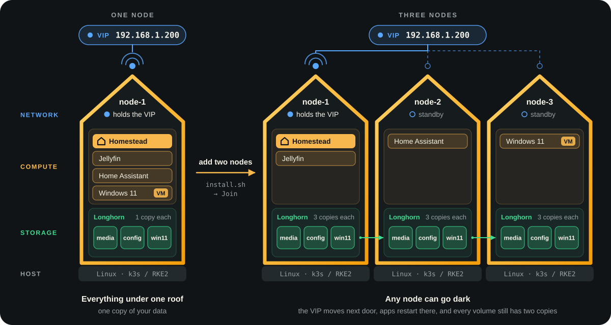

<p align="center">
  
</p>

<h3 align="center">A fully redundant homelab - compute, storage and network - in one friendly dashboard.</h3>

<p align="center">
  Run your apps and virtual machines across ordinary machines, and keep them running when one fails.<br>
  Built on Kubernetes, without having to become a Kubernetes expert.
</p>

<p align="center">
  <a href="https://github.com/wjcloudy/homestead/releases/latest"></a>
  <a href="https://github.com/wjcloudy/homestead/actions/workflows/ci.yml"></a>
  <a href="https://github.com/wjcloudy/homestead/pkgs/container/homestead"></a>
  <a href="https://wjcloudy.github.io/homestead/"></a>
  
  
</p>

<p align="center">
  <a href="https://wjcloudy.github.io/homestead/"><b>Live demo</b></a> &nbsp;·&nbsp;
  <a href="#quick-install"><b>Quick install</b></a> &nbsp;·&nbsp;
  <a href="#features"><b>Features</b></a> &nbsp;·&nbsp;
  <a href="https://github.com/wjcloudy/homestead/wiki"><b>Wiki</b></a> &nbsp;·&nbsp;
  <a href="docs/reference.md"><b>Reference</b></a>
</p>

<p align="center">
  <a href="https://wjcloudy.github.io/homestead/"></a>
</p>

<p align="center">
  <b>Try it before you install it:</b> the <a href="https://wjcloudy.github.io/homestead/">live demo</a> is the real interface on made-up data,
  in your browser. Click around every page; nothing you do there is saved.
</p>

## Why Homestead

A homelab on a single machine is one failed disk, power supply or update away
from going dark. Homestead spreads your homelab across two or more ordinary
machines - mini PCs, old desktops, virtual machines - so that every layer has
a spare:

<table>
<tr>
<td width="33%" valign="top">

**Compute**

Containers and VMs restart on a healthy node when one fails. Placement rules
decide where each app may run, and VMs live-migrate between hosts for
maintenance.

</td>
<td width="33%" valign="top">

**Storage**

Every volume is replicated across nodes by Longhorn, so a dead disk or host
loses nothing. Snapshots, scheduled backups to S3 or NFS, and restores in a
few clicks.

</td>
<td width="33%" valign="top">

**Network**

Each app can have its own virtual IP, announced by kube-vip, that stays
reachable when a node goes down. IP address management keeps track of every
address on your LAN.

</td>
</tr>
</table>

<p align="center">
  
</p>

**It feels like a NAS, not a cluster.** Homestead speaks in apps, volumes,
shares and VMs - the words you know from Unraid or Docker - and looks after
the Kubernetes underneath. When you want the raw objects, every resource is a
click away as YAML. It runs on [k3s](https://k3s.io), RKE2,
[Harvester HCI](https://harvesterhci.io) or any Kubernetes you already run.

## Quick install

On a Linux machine - a bare one, a k3s or RKE2 server, or a Harvester node:

```bash
curl -sfL https://raw.githubusercontent.com/wjcloudy/homestead/main/scripts/install.sh | sudo sh
```

- **New cluster or join one.** The installer checks the machine, then creates
  a **k3s** or **RKE2** cluster - or joins this machine to an existing one -
  with Longhorn, optionally KubeVirt, and Homestead. The installation summary
  lets you choose the version of each component.
- **More machines.** Run the same line on each further machine to join it.
- **Node doctor.** On any node, the same line checks the node and the cluster
  and offers a fix for each problem it finds.

**Disks on a k3s or RKE2 machine.** Give the system 64-128 GB and keep the
rest for Longhorn:

- **A second drive is best.** Leave it blank: **Nodes → Disks → Add to
  Longhorn** formats and mounts it safely, or keeps Longhorn data already on it.
- **One drive?** Install the OS on LVM (Ubuntu Server's default) and leave the
  volume group's spare space unallocated - Ubuntu gives the root volume 100 GB
  and leaves the rest free. **Use its free space** on the system disk turns it
  into a Longhorn disk of its own, keeping a tenth (at least 10 GB) for the
  system to grow into. Homestead does not resize the partitions of a running
  system, so plain partitions without LVM leave nothing it can use.
- Longhorn's V2 engine needs a whole drive of its own.

See [Installing on k3s](https://github.com/wjcloudy/homestead/wiki/Installing-on-k3s#disks).

Then open `http://<your machine>:8088` and create the administrator account.
Already running a cluster? Install with
[Helm or the manifest](docs/reference.md#install-with-helm). The wiki walks
through [k3s](https://github.com/wjcloudy/homestead/wiki/Installing-on-k3s),
[RKE2](https://github.com/wjcloudy/homestead/wiki/Installing-on-RKE2) and
[Harvester](https://github.com/wjcloudy/homestead/wiki/Installing-on-Harvester)
step by step.

## Features

<table>
<tr>
<td width="50%" valign="top">

**App Store** - Unraid's Community Applications catalogue, deployed properly:
volumes, ports, hardware and updates handled for you.

**Containers** - deploy, edit, logs and console; groups, autostart and
placement; update checks with a monitored rollout and one-click rollback.
Homestead updates itself from its own button on the top bar.

**Virtual machines** - KubeVirt VMs from a store of cloud images, your own
disks, or ISOs from your shares; hardware settings with Windows and Linux
presets (UEFI, Secure Boot, TPM, CPU model and pinning); a console, power
actions and live migration.

**Data protection** - snapshots, recurring backups, restores, and moving
containers and VMs between clusters. [Browse snapshot files](docs/snapshot-browsing.md)
read-only and download them while the live container or SMB volume stays online.

**Networking** - a virtual IP per app, collision-free port exposure, which
node answers for each address and whether it is reachable (with kube-vip's
missed addresses recorded for it), and IP address management with scanning
and UniFi sync.

**Imports** - containers and VMs from an Unraid server, a Docker Compose file,
or a VM disk image (qcow2, VMDK).

**API** - scoped, expiring API keys for Home Assistant, scripts and AI agents,
on a versioned, self-describing API ([OpenAPI](docs/api/openapi.json),
[guide](https://github.com/wjcloudy/homestead/wiki/API)).

</td>
<td width="50%" valign="top">

**Nodes and hardware** - node health, SMART drive health, disks, iGPU, Coral
and USB passthrough, and a terminal on every node.

**Cluster** - control-plane and etcd health, adding and removing hosts, and
platform versions: k3s or RKE2, Longhorn, KubeVirt, CDI, kube-vip and Multus
upgraded a step at a time, Harvester upgrades followed.

**Dashboard and alerts** - 90 days of history, push notifications, and MQTT
with Home Assistant discovery.

**Network shares and Portal** - Samba shares from any volume, and a tile for
every web interface on your network.

**Helm and Resources** - every Helm release and every Kubernetes object, with
its YAML and events.

**Linked clusters** - several clusters from one sign-in: switch between them,
see their containers and VMs together, and move workloads across.

**Safe by design** - viewer, operator and admin roles, guarded deletion, and
every job cancellable, with a rollback.

</td>
</tr>
</table>

## On your phone

Homestead installs as an app on iOS and Android (over HTTPS), with push
notifications for outages, degraded storage, failed jobs and image updates.

<p align="center">
  
</p>

## On the desktop

<p align="center">
  
</p>

<table>
<tr>
<td width="50%"><p align="center"><b>Containers</b></p></td>
<td width="50%"><p align="center"><b>Architecture</b></p></td>
</tr>
<tr>
<td width="50%"><p align="center"><b>Volumes</b></p></td>
<td width="50%"><p align="center"><b>Virtual machines</b></p></td>
</tr>
</table>

The live demo opens with a healthy cluster. For warning and failure examples,
use `?demo-scenario=incidents` or `?demo-scenario=critical` on the demo URL.
Local demos add these to `?demo=1`. Page audits check the healthy default,
dialog audits use the incident scenario, and CI checks all three health states.

Every screenshot is taken from Homestead's demo data by each release, so they
always show the current version. The same demo runs live at
**[wjcloudy.github.io/homestead](https://wjcloudy.github.io/homestead/)**, updated with each release.

## Where it runs

Homestead checks what the cluster has, and each page works with that.

| | k3s | Harvester | RKE2 or other Kubernetes |
|---|---|---|---|
| **Install** | [one line](docs/reference.md#one-line-install-and-node-doctor) from bare Linux | [one line](docs/reference.md#one-line-install-and-node-doctor) on a node, or Helm or the manifest | RKE2: [one line](docs/reference.md#one-line-install-and-node-doctor) from bare Linux, or onto an RKE2 server; any other: [Helm or the manifest](docs/reference.md#installing-with-the-manifest) |
| **Containers, App Store, Compose, Portal, Networking, IP addresses, Resources, dashboard** | yes | yes | yes |
| **Volumes, data protection, disks** | yes, with Longhorn - the installer adds it, or Settings → Hardware and storage → Add-ons | yes, Longhorn is built in | yes, with Longhorn - Settings → Hardware and storage → Add-ons installs it on RKE2 |
| **Virtual machines** | yes, with [KubeVirt](https://kubevirt.io) - the installer adds it, or Add-ons | built in | yes, with KubeVirt - Add-ons installs it on RKE2 |
| **Addresses for apps** | a VIP per app with kube-vip, and LAN addresses with Multus (and macvtap for VMs, or a host bridge Homestead can make) - installed by Homestead - beside the nodes' own addresses (ServiceLB) | a VIP per app (kube-vip), LAN addresses (Multus) | RKE2 from the installer: as k3s; others: MetalLB or kube-vip |
| **Helm charts** | yes (k3s's Helm controller) | yes (RKE2's Helm controller) | yes on RKE2; listing only without a Helm controller |
| **Adding a host** | the join command for a worker or a server | a guide to Harvester's installer | RKE2's join commands |
| **Platform upgrades** | k3s, Longhorn, KubeVirt, CDI, kube-vip, Multus and macvtap, a step at a time | followed on the Cluster page | RKE2: as k3s; others: shown |

## Documentation

- **[Wiki](https://github.com/wjcloudy/homestead/wiki)** - the guided tour:
  building a cluster, installing Homestead, then each page in turn.
- **[Reference](docs/reference.md)** - every feature in depth, security notes,
  and how releases are made.
- **[Troubleshooting](https://github.com/wjcloudy/homestead/wiki/Troubleshooting)** -
  the problems people actually hit, and the node doctor.

## Contributing

See [CONTRIBUTING.md](CONTRIBUTING.md) for how the project is put together,
running it locally against demo data, the tests, and how releases are made.

## Licence

Homestead is released under the [MIT License](LICENSE). The Monaco editor it
bundles, the images it starts and the catalogue it reads are listed with their
own terms in [THIRD_PARTY_NOTICES.md](THIRD_PARTY_NOTICES.md), along with the
trademarks it mentions.

Unraid® is a registered trademark of Lime Technology, Inc. Homestead is not
affiliated with, endorsed, or sponsored by Lime Technology, Inc.
